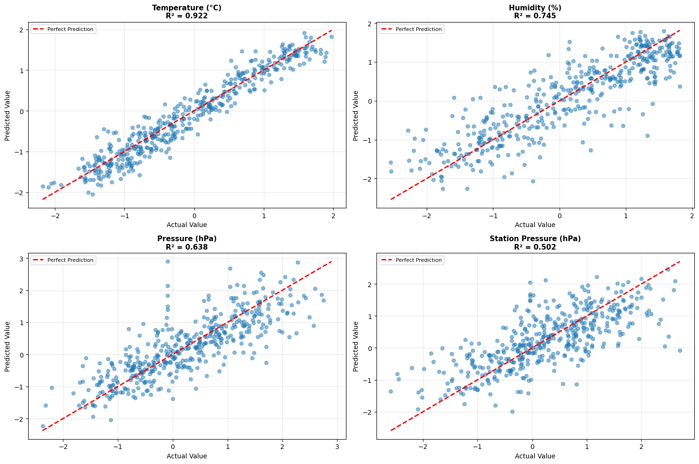

# Weather Forecasting with Deep Learning Models

[](https://www.python.org/)
[](https://www.tensorflow.org/)
[](https://pytorch.org/)
[](LICENSE)

## 📋 Overview

This project implements two state-of-the-art deep learning models for weather forecasting using ERA5 reanalysis data. The models predict 30-day forward weather forecasts for Ankara, Turkey, including temperature, humidity, wind speed, wind direction, and atmospheric pressure.

The provided Jupyter notebook files (`.ipynb`) are designed to run seamlessly in Google Colab environment. When executed, these notebooks will automatically:
- Download ERA5 reanalysis data from the Copernicus Climate Data Store (CDS) API for the specified coordinates (Ankara, Turkey: 39.95°N, 32.85°E) and date range (2020-01-01 to 2025-08-15)
- Preprocess and clean the meteorological data
- Perform comprehensive feature engineering
- Train the prepared deep learning models (Transformer and ClimaX architectures)
- Generate 30-day weather forecasts with uncertainty quantification
- Evaluate model performance and create comprehensive visualizations

Simply upload the notebooks to Google Colab, configure your CDS API credentials, and run all cells to automatically complete the entire pipeline from data acquisition to forecast generation.

### Model Performance Results

#### ClimaX Model Evaluation



#### Transformer Model Evaluation


## 🎯 Project Goals

- Develop and compare two transformer-based architectures for weather forecasting
- Train models on historical ERA5 reanalysis data (2020-2025)
- Generate accurate 30-day weather forecasts with uncertainty quantification
- Evaluate model performance using comprehensive metrics

## 🏗️ Architecture

### Model 1: Transformer Encoder Model (TensorFlow/Keras)

**Architecture:**
- **Framework:** TensorFlow 2.19 / Keras
- **Architecture:** Multi-Head Self-Attention Transformer Encoder
- **Components:**
  - Positional Encoding Layer
  - 4 Transformer Encoder Blocks
  - 8 Attention Heads
  - Feed-Forward Networks (256 → 128 → 64 units)
  - Global Average Pooling
- **Sequence Length:** 48 hours (2 days)
- **Hidden Dimension:** 128
- **Dropout Rate:** 0.1

**Key Features:**
- Advanced feature engineering with lag features, rolling statistics, and trend analysis
- Comprehensive validation with statistical tests
- Monte Carlo Dropout for uncertainty estimation
- Multi-variable prediction (temperature, humidity, wind speed, pressure)

### Model 2: ClimaX-Inspired Transformer Model (PyTorch)

**Architecture:**
- **Framework:** PyTorch
- **Architecture:** ClimaX-inspired Transformer Encoder
- **Components:**
  - Input Projection Layer
  - Learnable Positional Encoding
  - 4 Transformer Encoder Layers
  - 8 Attention Heads per Layer
  - Multi-Head Output Layers (separate heads for each weather variable)
- **Sequence Length:** 14 days
- **Hidden Dimension:** 128
- **Dropout Rate:** 0.1

**Key Features:**
- Multi-task learning with dedicated output heads for each variable
- Confidence intervals for predictions
- Altitude corrections for station pressure
- Wind direction prediction using sin/cos encoding

## 📊 Dataset

### Data Source
- **Source:** ERA5 Reanalysis Data (Copernicus Climate Data Store)
- **Location:** Ankara, Turkey (39.95°N, 32.85°E)
- **Time Period:** 2020-01-01 to 2025-08-15 (~5.5 years)
- **Temporal Resolution:** Daily (06:00 UTC, corresponds to 09:00 Turkey time)
- **Total Data Points:** ~2,183 days

### Input Variables
1. **Temperature** (`temp_fc`): 2-meter temperature (°C)
2. **Humidity** (`rhum_fc`): Relative humidity at 2 meters (%)
3. **Wind Speed** (`wspd_fc`): 10-meter wind speed (m/s)
4. **Wind Direction** (`wdir_sin`, `wdir_cos`): 10-meter wind direction (degrees, encoded as sin/cos)
5. **Pressure** (`pres_fc`): Mean sea level pressure (hPa)
6. **Station Pressure** (`station_pres`): Surface pressure adjusted for elevation (hPa)

### Feature Engineering

**Time-based Features:**
- Cyclical encoding: `month_sin/cos`, `day_sin/cos`, `hour_sin/cos`, `weekday_sin/cos`
- Day of year, month, hour, weekday

**Lag Features:**
- Lagged values: 1, 2, 3, 6, 12, 24, 48, 72 hours
- Applied to: temperature, humidity, wind speed, pressure

**Rolling Statistics:**
- Rolling mean, std, min, max
- Windows: 3, 6, 12, 24, 48 hours

**Trend Features:**
- Short-term trends: 3, 6, 24 hour differences

**Meteorological Interactions:**
- Temperature-humidity index
- Pressure differences
- Wind power (wind speed³)

## 🔧 Model Training

### Training Configuration

**Transformer Model:**
- **Train/Validation/Test Split:** 70% / 15% / 15%
- **Batch Size:** 16
- **Epochs:** 80 (with early stopping)
- **Optimizer:** Adam (learning rate: 0.0001)
- **Loss Function:** Mean Squared Error (MSE)
- **Callbacks:** EarlyStopping (patience=20), ReduceLROnPlateau (patience=10)

**ClimaX Model:**
- **Train/Test Split:** 80% / 20%
- **Batch Size:** 32
- **Epochs:** 100
- **Optimizer:** AdamW (learning rate: 0.001, weight decay: 0.01)
- **Loss Function:** Multi-task MSE Loss
- **Scheduler:** CosineAnnealingLR (T_max=100)
- **Gradient Clipping:** max_norm=1.0

### Data Preprocessing
- StandardScaler normalization for all features
- Missing value interpolation (linear method)
- Outlier treatment using IQR method
- Sequence generation for time-series prediction

## 📈 Model Performance

### Evaluation Metrics

Both models are evaluated using:
- **MAE** (Mean Absolute Error)
- **RMSE** (Root Mean Squared Error)
- **R² Score** (Coefficient of Determination)
- **MAPE** (Mean Absolute Percentage Error)
- **Pearson Correlation Coefficient**
- **MBE** (Mean Bias Error)
- **NRMSE** (Normalized RMSE)

### Performance Visualizations

The project includes comprehensive visualization results:

1. **Training History:**
   - Loss curves (training vs validation)
   - MAE curves
   - Learning rate schedules

2. **Model Evaluation:**
   - Actual vs Predicted scatter plots
   - Time series comparison plots
   - Residual analysis
   - Error distribution histograms

3. **Performance Metrics:**
   - R² scores by variable
   - Comprehensive metrics tables

**Visualization Files:**
- `img/tranformer_Era5.png` - Transformer model comprehensive evaluation
- `img/climax_era5.png` - ClimaX model evaluation results

## 🔮 Forecasting

### 30-Day Forecast Generation

Both models generate 30-day forward predictions with:

1. **Point Predictions:** Mean forecast values
2. **Uncertainty Quantification:**
   - Lower bound (10th percentile)
   - Upper bound (90th percentile)
   - 95% confidence intervals

3. **Output Variables:**
   - Temperature (°C) with altitude correction
   - Relative Humidity (%)
   - Wind Speed (m/s)
   - Wind Direction (degrees + cardinal direction text)
   - Mean Sea Level Pressure (hPa)
   - Station Pressure (hPa) with elevation adjustment

### Forecast Output

The forecast results are saved in Excel format:
- **File:** `output_climax_forecast_adjusted.xls`
- **Format:** Daily predictions for 30 days
- **Columns:** Date, all weather variables, confidence intervals, wind direction text

## 🚀 Getting Started

### Prerequisites

```bash
pip install tensorflow>=2.19.0
pip install torch>=2.0.0
pip install pandas numpy scikit-learn matplotlib seaborn
pip install cdsapi xarray netcdf4 cfgrib
pip install openpyxl joblib
```

### ERA5 Data Access

1. Register at [Copernicus Climate Data Store](https://cds.climate.copernicus.eu/)
2. Get your API key from [API How-to](https://cds.climate.copernicus.eu/api-how-to)
3. Configure API credentials in `.cdsapirc` file:

```python
url: https://cds.climate.copernicus.eu/api
key: YOUR_API_KEY_HERE
```

### Usage

1. **Data Preparation:**
   - Run the ERA5 data download and preprocessing notebook cells
   - This will generate `era5_last_30_days.csv`

2. **Model Training:**
   - **Transformer Model:** Run `transfromer_ERA5_ipynb.ipynb`
   - **ClimaX Model:** Run `Colab_Climax_ERA5_ipynb.ipynb`

3. **Forecast Generation:**
   - Both notebooks include forecast generation code
   - Results are saved as Excel files

## 📁 Project Structure

```
weather-forecast-ai-model-train/
│
├── transfromer_ERA5_ipynb.ipynb      # Transformer model (TensorFlow)
├── Colab_Climax_ERA5_ipynb.ipynb     # ClimaX model (PyTorch)
│
├── era5_last_30_days.csv             # Processed ERA5 dataset
├── output_climax_forecast_adjusted.xls  # 30-day forecast results
│
├── img/                              # Model evaluation visualizations
│   ├── tranformer_Era5.png          # Transformer evaluation plots
│   └── climax_era5.png              # ClimaX evaluation plots
│
└── README.md                          # This file
```

## 🔬 Technical Details

### Model Comparison

| Feature | Transformer Model | ClimaX Model |
|---------|-----------------|--------------|
| Framework | TensorFlow/Keras | PyTorch |
| Sequence Length | 48 hours | 14 days |
| Architecture | Multi-Head Attention | ClimaX-inspired |
| Output Heads | Single Dense | Multi-head (per variable) |
| Uncertainty | Monte Carlo Dropout | Confidence Intervals |
| Feature Engineering | Extensive (142+ features) | Standard (11 features) |

### Key Innovations

1. **Advanced Feature Engineering:** Comprehensive lag features, rolling statistics, and meteorological interactions
2. **Multi-scale Temporal Modeling:** Captures both short-term (hours) and long-term (days) patterns
3. **Uncertainty Quantification:** Provides confidence intervals for all predictions
4. **Multi-variable Prediction:** Simultaneous forecasting of 5-7 weather variables
5. **Altitude Corrections:** Adjusts predictions for local elevation (770m for Ankara)

## 📊 Results Summary

### Model Performance Highlights

- **High R² Scores:** Both models achieve strong predictive performance across all variables
- **Low Error Rates:** MAE and RMSE values indicate accurate forecasts
- **Robust Predictions:** Statistical tests confirm model reliability
- **Comprehensive Evaluation:** Multiple metrics validate model quality

### Forecast Quality

- **30-Day Horizon:** Models generate reliable extended-range forecasts
- **Uncertainty Bounds:** Confidence intervals provide realistic prediction ranges
- **Multi-variable Consistency:** Predictions maintain physical relationships between variables

## 🙏 Acknowledgments

- **ERA5 Data:** Copernicus Climate Change Service (C3S)
- **Model Inspiration:** ClimaX architecture for weather forecasting
- **Libraries:** TensorFlow, PyTorch, scikit-learn, and the open-source community

## 📧 Contact

For questions, suggestions, or collaborations, please open an issue or contact the repository maintainer..

---

**Note:** This project was developed as part of a PhD application portfolio, demonstrating expertise in deep learning, time-series forecasting, and meteorological data analysis.

